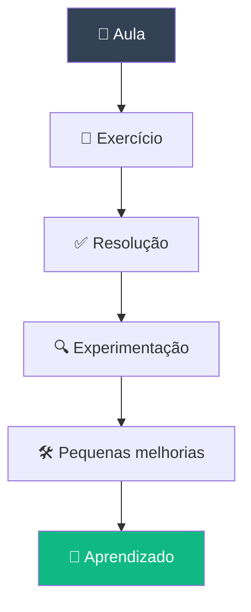

# 🌐 Trilha Lógica de Programação para WEB

> **Descomplica VNT 4.0 · Lógica • Web • JavaScript**

Este repositório reúne minha jornada de aprendizado na **Trilha Lógica de Programação para WEB**, passando pelos fundamentos de lógica, introdução ao desenvolvimento Web e JavaScript.

A proposta é acompanhar não apenas os projetos e exercícios desenvolvidos durante os cursos, mas também registrar minha **evolução, experimentações e aprendizados ao longo da trilha**.

---

## 🚀 Sobre a trilha

A trilha foi estruturada para construir, de forma progressiva, uma base sólida para o desenvolvimento Web.

O aprendizado começa pelos fundamentos da **lógica de programação**, passa pela compreensão da **Web** e evolui para o desenvolvimento utilizando **JavaScript**.

```mermaid# 🧠 Trilha Lógica de Programação para WEB

<div align="center">


**Lógica de Programação**

</div>

<p align="center">
  
</p>

---

## 📖 Sobre

Este repositório reúne meus exercícios e aprendizados do módulo **Lógica de Programação**, parte da trilha **Descomplica VNT 4.0**.

A proposta é resolver os exercícios propostos em aula e, a partir deles, praticar um pouco além do que foi pedido — testando possibilidades e reforçando os conceitos.

> 🌱 *Este é o primeiro módulo da trilha — os próximos passos (Web e JavaScript) estão documentados no repositório geral da trilha.*

---

## 🗂️ Índice

- [Sobre o módulo](#-sobre-o-módulo)
- [Exercícios](#-exercícios)
- [Tecnologias](#️-tecnologias)
- [Aprender além do exercício](#-aprender-além-do-exercício)
- [Como navegar no repositório](#-como-navegar-no-repositório)

---

## 🧠 Sobre o módulo

O módulo é dedicado à construção dos fundamentos de lógica necessários para começar a programar: variáveis, operadores, condições, repetições e funções.

Os exercícios práticos aqui documentados são usados para treinar os conceitos apresentados durante as aulas.

---

## 🧩 Exercícios

A proposta é resolver os exercícios durante as aulas e, depois, realizar pequenas melhorias e experimentações por conta própria:

- Praticar um pouco além do que foi solicitado
- Testar diferentes possibilidades
- Melhorar pequenas partes do código
- Entender melhor os conceitos
- Desenvolver autonomia na resolução dos problemas

> 💡 *A ideia é aprender fazendo — e continuar experimentando depois que o exercício termina.*

**🚀 Projeto Final:** reúne e aplica os conhecimentos trabalhados ao longo das atividades do módulo.

---

## 🛠️ Tecnologias

```text
🧠 Lógica
   │
   ├── Variáveis
   ├── Operadores
   ├── Condições
   ├── Repetições
   └── Funções
```

**Ferramentas:** HTML5 · JavaScript · Git · GitHub

---

## 🧪 Aprender além do exercício



Depois de concluir um exercício, faço pequenas alterações para testar possibilidades e entender melhor o comportamento do código — sem transformar exercícios introdutórios em projetos sofisticados, mas aproveitando cada atividade como uma oportunidade extra de estudo.

---

## 🧭 Como navegar no repositório

```text
📦 trilha-logica
 ┣ 📂 exercicios
 ┣ 📂 projeto-final
 ┗ 📜 README.md
```

---

<div align="center">

### 💻 Descomplica VNT 4.0

Aprender · Praticar · Experimentar · Evoluir

</div>

flowchart LR
    A["🧠 Lógica de Programação"] --> B["🌐 Introdução à Web"]
    B --> C["⚡ JavaScript"]
    C --> D["🚀 Próximos desafios"]
```

Atualmente estou no **primeiro módulo da trilha**, então este repositório continuará crescendo conforme novos conteúdos, exercícios e projetos forem desenvolvidos.

> 🌱 **Ainda há muito pela frente — este é o começo da jornada.**

---

# 📚 Estrutura da trilha

## 01 · Lógica de Programação para WEB

O primeiro módulo é dedicado à construção dos fundamentos de lógica necessários para começar a programar.

Aqui estão sendo desenvolvidos diversos **exercícios práticos**, utilizados para treinar os conceitos apresentados durante as aulas.

### 🧩 Exercícios

A proposta inicial é resolver os exercícios durante as aulas e, depois, realizar **pequenas melhorias e experimentações** por conta própria.

Como são exercícios introdutórios, as melhorias também são simples. A intenção não é transformar os exercícios em projetos complexos, mas aproveitar cada atividade como uma oportunidade para:

* praticar um pouco além do que foi solicitado;
* testar diferentes possibilidades;
* melhorar pequenas partes do código;
* entender melhor os conceitos;
* desenvolver autonomia na resolução dos problemas.

> 💡 **A ideia é aprender fazendo — e continuar experimentando depois que o exercício termina.**

### 🚀 Projeto Final

O módulo também possui um **Projeto Final**, desenvolvido para reunir e aplicar os conhecimentos trabalhados ao longo das atividades.

---

# 🌐 02 · Introdução à Web

O próximo módulo será dedicado aos fundamentos da Web, ampliando os conhecimentos construídos durante a etapa de lógica.

Nesta etapa, a ideia é compreender melhor como as páginas e aplicações Web são estruturadas e como os conhecimentos anteriores começam a se conectar com o desenvolvimento para a Web.

### 🚀 Projeto Final

O módulo contará também com um projeto final, colocando em prática os conceitos apresentados durante o curso.

---

# ⚡ 03 · JavaScript

Após os fundamentos de lógica e a introdução à Web, a trilha avança para **JavaScript**.

Essa etapa será importante para aprofundar a programação no desenvolvimento Web, trabalhando com uma linguagem essencial para criar páginas mais dinâmicas e interativas.

### 🚀 Projeto Final

Assim como nos módulos anteriores, haverá um projeto final para consolidar os conhecimentos desenvolvidos durante o curso.

---

# 🛠️ Tecnologias

As tecnologias serão incorporadas progressivamente conforme o avanço da trilha.

```text
🧠 Lógica
   │
   ├── Variáveis
   ├── Operadores
   ├── Condições
   ├── Repetições
   └── Funções
        │
        ▼
🌐 Web
   │
   ├── Estrutura
   ├── Documentos Web
   └── Fundamentos
        │
        ▼
⚡ JavaScript
   │
   ├── Programação
   ├── Interatividade
   └── Desenvolvimento Web
```

### Atualmente

* HTML5
* JavaScript
* Git
* GitHub

> 🔧 A stack será ampliada conforme novos módulos forem concluídos.

---

# 🧪 Aprender além do exercício

Uma das propostas pessoais neste repositório é não apenas concluir as atividades, mas **explorar um pouco além delas**.

O processo funciona de forma simples:

```text
        📖 Aula
          ↓
      📝 Exercício
          ↓
      ✅ Resolução
          ↓
    🔍 Experimentação
          ↓
     🛠️ Pequenas melhorias
          ↓
       🧠 Aprendizado
```

Depois de concluir um exercício, algumas alterações simples são realizadas para testar possibilidades e compreender melhor o comportamento do código.

Por serem exercícios iniciais, essas alterações não têm como objetivo criar soluções sofisticadas, mas sim **aproveitar cada exercício como uma oportunidade adicional de estudo**.

---

# 📈 Uma trilha em construção

Este repositório ainda está no começo.

No momento, o foco está no **Módulo 01 — Lógica de Programação para WEB**, mas muitos conteúdos, exercícios e projetos ainda serão desenvolvidos ao longo da trilha.

Por isso, a estrutura deste repositório representa também um **registro da evolução dos estudos**.

```text
                    HOJE
                      │
                      ▼
              🧠 Lógica de Programação
                      │
                      ▼
                 🌐 Web
                      │
                      ▼
                ⚡ JavaScript
                      │
                      ▼
                 🚀 Projetos
                      │
                      ▼
                📈 Evolução
```

A cada novo módulo, novos conhecimentos serão adicionados e os projetos anteriores passarão a fazer parte de uma visão maior do desenvolvimento Web.

---

# 🎯 Objetivo

Construir uma base consistente em **lógica de programação e desenvolvimento Web**, avançando gradualmente para JavaScript e projetos mais completos.

Mais do que simplesmente concluir os exercícios, a proposta é transformar cada etapa em uma oportunidade de **praticar, experimentar, entender e evoluir**.

---

# 🌱 Primeiros passos

Este repositório marca o início dessa jornada.

Ainda há muitos exercícios para resolver, conceitos para aprender e projetos para construir.

**O primeiro módulo é apenas o começo. 🚀**

```text
LÓGICA  →  WEB  →  JAVASCRIPT  →  PROJETOS  →  EVOLUÇÃO
   🧠         🌐          ⚡             🚀           📈
```

---

## 💻 Descomplica VNT 4.0

Esta trilha faz parte do **Descomplica VNT 4.0**, dentro da formação voltada ao desenvolvimento de conhecimentos em **Lógica, Web e JavaScript**.

O repositório será atualizado progressivamente conforme os cursos, exercícios e projetos forem realizados.

> **Aprender. Praticar. Experimentar. Evoluir.**
>
> 🌐 **Esta jornada está apenas começando.**
