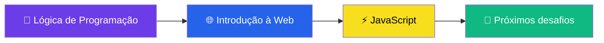
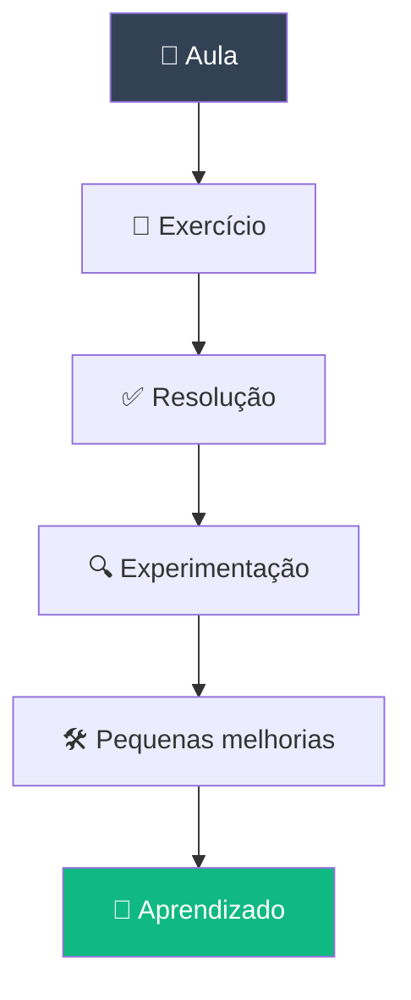

# 🌐 Trilha Lógica de Programação para WEB

<div align="center">


**Lógica • Web • JavaScript**

</div>

<p align="center">
  
</p>

---

## 📖 Sobre

Este repositório reúne minha jornada de aprendizado na **Trilha Lógica de Programação para WEB**, passando pelos fundamentos de lógica, introdução ao desenvolvimento Web e JavaScript.

A proposta é acompanhar não apenas os projetos e exercícios desenvolvidos durante os cursos, mas também registrar minha **evolução, experimentações e aprendizados** ao longo da trilha.

> 🌱 *Ainda há muito pela frente — este é o começo da jornada.*

---

## 🗂️ Índice

- [Sobre a trilha](#-sobre-a-trilha)
- [Estrutura da trilha](#-estrutura-da-trilha)
- [Tecnologias](#️-tecnologias)
- [Aprender além do exercício](#-aprender-além-do-exercício)
- [Objetivo](#-objetivo)
- [Como navegar no repositório](#-como-navegar-no-repositório)

---

## 🚀 Sobre a trilha

A trilha foi estruturada para construir, de forma progressiva, uma base sólida para o desenvolvimento Web — começando pela **lógica de programação**, passando pela compreensão da **Web** e evoluindo para o desenvolvimento com **JavaScript**.



---

## 📚 Estrutura da trilha

<details>
<summary><strong>01 · 🧠 Lógica de Programação para WEB</strong></summary>

<br>

O primeiro módulo é dedicado à construção dos fundamentos de lógica necessários para começar a programar. Aqui estão sendo desenvolvidos diversos **exercícios práticos** para treinar os conceitos apresentados nas aulas.

**🧩 Exercícios**

A proposta é resolver os exercícios durante as aulas e, depois, realizar pequenas melhorias e experimentações por conta própria:

- Praticar um pouco além do que foi solicitado
- Testar diferentes possibilidades
- Melhorar pequenas partes do código
- Entender melhor os conceitos
- Desenvolver autonomia na resolução dos problemas

> 💡 *A ideia é aprender fazendo — e continuar experimentando depois que o exercício termina.*

**🚀 Projeto Final:** reúne e aplica os conhecimentos trabalhados ao longo das atividades do módulo.

</details>

<details>
<summary><strong>02 · 🌐 Introdução à Web</strong></summary>

<br>

Módulo dedicado aos fundamentos da Web, ampliando os conhecimentos construídos na etapa de lógica — entendendo como páginas e aplicações Web são estruturadas.

**🚀 Projeto Final:** aplica na prática os conceitos apresentados no curso.

</details>

<details>
<summary><strong>03 · ⚡ JavaScript</strong></summary>

<br>

Etapa para aprofundar a programação no desenvolvimento Web, trabalhando com uma linguagem essencial para criar páginas mais dinâmicas e interativas.

**🚀 Projeto Final:** consolida os conhecimentos desenvolvidos ao longo do curso.

</details>

---

## 🛠️ Tecnologias

<p align="center">
  
</p>

```text
🧠 Lógica            🌐 Web                  ⚡ JavaScript
   │                    │                       │
   ├── Variáveis        ├── Estrutura           ├── Programação
   ├── Operadores       ├── Documentos Web      ├── Interatividade
   ├── Condições        └── Fundamentos         └── Dev Web
   ├── Repetições
   └── Funções
```

> 🔧 A stack será ampliada conforme novos módulos forem concluídos.

---

## 🧪 Aprender além do exercício



Depois de concluir um exercício, faço pequenas alterações para testar possibilidades e entender melhor o comportamento do código — sem transformar exercícios introdutórios em projetos sofisticados, mas aproveitando cada atividade como uma oportunidade extra de estudo.

---

## 🎯 Objetivo

Construir uma base consistente em **lógica de programação e desenvolvimento Web**, avançando gradualmente para JavaScript e projetos mais completos — transformando cada etapa em uma oportunidade de **praticar, experimentar, entender e evoluir**.

---

## 🧭 Como navegar no repositório

```text
📦 trilha-logica-web
 ┣ 📂 01-logica-programacao
 ┃ ┣ 📂 exercicios
 ┃ ┗ 📂 projeto-final
 ┣ 📂 02-introducao-web
 ┃ ┗ 📂 (em breve)
 ┣ 📂 03-javascript
 ┃ ┗ 📂 (em breve)
 ┗ 📜 README.md
```

---

<div align="center">

### 💻 Descomplica VNT 4.0

Aprender · Praticar · Experimentar · Evoluir

🌐 **Esta jornada está apenas começando.**

</div>
