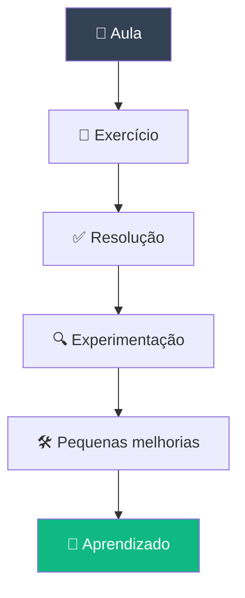

# 🧠 Trilha Lógica de Programação para WEB

<div align="center">


**Lógica de Programação**

</div>

<p align="center">
  
</p>

---

## 📖 Sobre

Este repositório reúne meus exercícios e aprendizados do módulo **Lógica de Programação**, parte da trilha **Descomplica VNT 4.0**.

A proposta é resolver os exercícios propostos em aula e, a partir deles, praticar um pouco além do que foi pedido — testando possibilidades e reforçando os conceitos.

> 🌱 *Este é o primeiro módulo da trilha — os próximos passos (Web e JavaScript) estão documentados no repositório geral da trilha.*

---

## 🗂️ Índice

- [Sobre o módulo](#-sobre-o-módulo)
- [Exercícios](#-exercícios)
- [Tecnologias](#️-tecnologias)
- [Aprender além do exercício](#-aprender-além-do-exercício)
- [Como navegar no repositório](#-como-navegar-no-repositório)

---

## 🧠 Sobre o módulo

O módulo é dedicado à construção dos fundamentos de lógica necessários para começar a programar: variáveis, operadores, condições, repetições e funções.

Os exercícios práticos aqui documentados são usados para treinar os conceitos apresentados durante as aulas.

---

## 🧩 Exercícios

A proposta é resolver os exercícios durante as aulas e, depois, realizar pequenas melhorias e experimentações por conta própria:

- Praticar um pouco além do que foi solicitado
- Testar diferentes possibilidades
- Melhorar pequenas partes do código
- Entender melhor os conceitos
- Desenvolver autonomia na resolução dos problemas

> 💡 *A ideia é aprender fazendo — e continuar experimentando depois que o exercício termina.*

**🚀 Projeto Final:** reúne e aplica os conhecimentos trabalhados ao longo das atividades do módulo.

---

## 🛠️ Tecnologias

```text
🧠 Lógica
   │
   ├── Variáveis
   ├── Operadores
   ├── Condições
   ├── Repetições
   └── Funções
```

**Ferramentas:** HTML5 · JavaScript · Git · GitHub

---

## 🧪 Aprender além do exercício



Depois de concluir um exercício, faço pequenas alterações para testar possibilidades e entender melhor o comportamento do código — sem transformar exercícios introdutórios em projetos sofisticados, mas aproveitando cada atividade como uma oportunidade extra de estudo.

---

## 🧭 Como navegar no repositório

```text
📦 trilha-logica
 ┣ 📂 exercicios
 ┣ 📂 projeto-final
 ┗ 📜 README.md
```

---

<div align="center">

### 💻 Descomplica VNT 4.0

Aprender · Praticar · Experimentar · Evoluir

</div>
